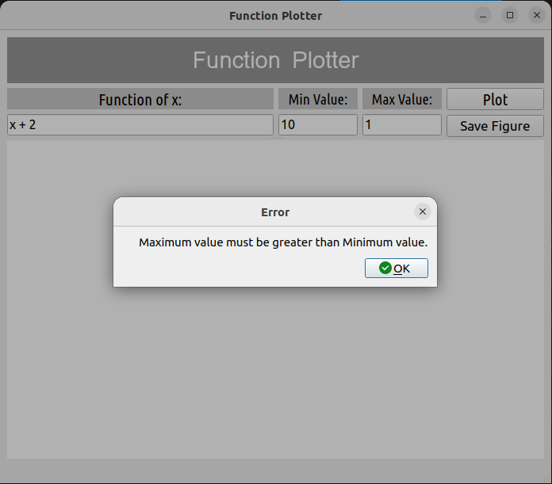

# Master-Micro-Python-Internship

## Install required packages

```
pip install -r requirements.txt
```

## Run the code

```
python main.py

# or

python3 main.py
```

## How it works

<p>

The application takes the user function from the input field with the minimum and maximum values.<br />

The user function consists of an x variable either in capital or small letter, and other numbers.<br />

The function <em>"check_entered_input_values"</em> checks the user input values that they are not empty values, and the maximum value is greater than the minimum value.<br />

In case of invalid input values, the application shows the error message using <em>QMessageBox</em> from <em>PySide2.QtWidgets</em>.<br />

The function <em>"calculate_function_expression"</em> takes the user function from the input field then removes the spaces between characters and finally divides it into expressions.<br />

These expressions are then added together into a single equation variable. According to the minimum and maximum value, the equation variable is calculated and the result is displayed in the <em>matplotlib figure</em>.<br />

The figure title has the user function written in the right format. Like if the user typed <Strong>(x + 4.3 + x + 2 + 3*x + x^2)</Strong> <br /> it will be modified into <strong>(x^2 + 5*x + 6.3 )</strong>. <br />

</p>

## Demo

https://github.com/Abdelrahmanhassan1/Master-Micro-Python-Internship/assets/66575436/3e06d9f2-d797-4583-b53e-1c3a7adf8653

## Screenshots

### Examples of Valid Inputs

<h3>1st order function</h3>


<h3>2nd order function</h3>


<h3>Reformating the function in the figure title</h3>


<h3>plotting function with factors of x</h3>


<h3>Reordering the function in the figure title</h3>


### Examples of Invalid Inputs

<h3>Empty input fields</h3>


<h3>Maximum value is less than minimum value</h3>



<h3>Invalid float numbers</h3>


<h3>Invalid characters</h3>


<h3>Invalid function format</h3>


<h3>Division by zero</h3>


## Added Feature

<p>
<em>Save figure</em> button for saving the figure plotted in the gui, poping up a message box for the user to enter the name of the figure to be saved. <br />
Second  message box appears to tell the user for successful or unsuccessful saving of the figure. <br />
</p>


## Testing the application

```
# run the test
pytest
```

<p>The tests include:
<ul>
<li>Testing empty fields</li>
<li>Testing greater minimum value that maximum value</li>
<li>Testing invalid float numbers</li>
<li>Testing invalid characters</li>
<li>Testing invalid function format</li>
<li>Testing division by zero</li>
<li>Testing valid input values</li>

</ul>
</p>
